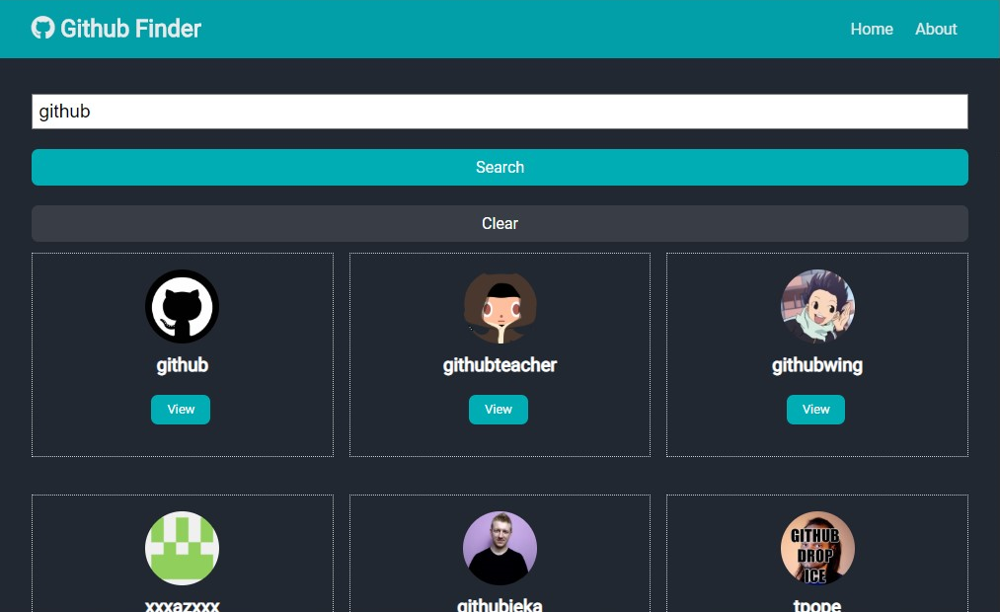

## Preview
https://github-finder.higor-bianchetti.now.sh/

**Obs: The github api accepts only a limited number of calls to the API without providing a key. Therefore, if you want to test it on your machine, it is advisable to create the access keys on github and link them to the project.**

## Available Scripts

In the project directory, you can run:

### `yarn start`

Runs the app in the development mode. 
Open [http://localhost:3000](http://localhost:3000) to view it in the browser.

The page will reload if you make edits. 
You will also see any lint errors in the console.

### `yarn build`

Builds the app for production to the `build` folder. 
It correctly bundles React in production mode and optimizes the build for the best performance.

The build is minified and the filenames include the hashes. 
Your app is ready to be deployed!

See the section about [deployment](https://facebook.github.io/create-react-app/docs/deployment) for more information.

## Giving feedback

Feedback is always welcome, so if you have any to give on this project please send it to me on `higorbianchetti@gmail.com`
